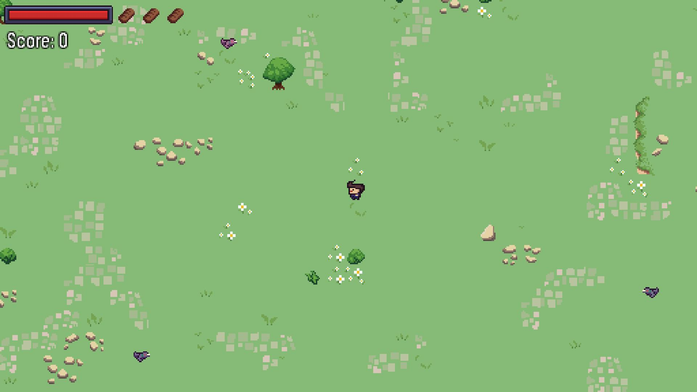

Just a Stroll
=============

Source code for a Ludum Dare 46 entry.

Theme: *"keep it alive"*.

[Official submission](https://ldjam.com/events/ludum-dare/46/just-a-stroll) +
[itch.io](https://killy9999.itch.io/just-a-stroll) (contains an embedded HTML5
version as well as a Linux build).

*For It this was just a stroll in the park until bloodthirsty pigeons starting
attacking him.  Now you have to keep It alive!  Kill the pigeons by throwing
stones.  Throw them some breadcrumbs to temporarily stop them from following It.
It has an unlimited number of stones but only three portions of breadcrumbs.
Walking over rocks will slow It down, so be careful.*


Controls
========

  * MOVE: W/A/S/D or Arrows
  * Aiming: mouse
  * Throw stones: left mouse button
  * Throw bread: right mouse button
  * Exit: press Esc twice


Scoring
=======

10 points per bird multiplied by accuracy.  Yes, you will lose points if you
throw stones that miss.  It's better to throw less stones but accurately.


Building from source
====================

Written in [Haxe](https://haxe.org/) using [heaps.io](https://heaps.io/) engine
and [deepnightLibs](https://github.com/deepnight/deepnightLibs) library, with
[gameBase](https://github.com/deepnight/gameBase) as a starting point.  To
compile and run the game you need a working installation of Haxe 4.x and
[Hashlink](https://hashlink.haxe.org).  Required libraries are included as
submodules in the repo.  If you're on Linux you run `./init.sh` script after
checkout.  It will update the submodules, create a local `haxelib` sandbox, and
install the required libraries into the sandbox.  Alternatively you can do this
manually by running the following command to clone submodules:

```
git submodule init
git submodule update
```

and then install the required libraries in a local sandbox with:

```
haxelib newrepo
haxelib git heaps heaps/
haxelib git deepnightLibs deepnightLibs/
haxelib git castle castle/
haxelib git heapsOgmo heapsOgmo/

haxelib install hlsdl
```

The following build targets are available:

  * SDL (Linux, hashlink vm): compile with `haxe hl.sdl.hxml`, run with `hl bin/stroll.hl`
  * SDL (Linux, native): compile with `./build.sh`, run with `./bin/stroll`
  * DirectX (Windows, haslink vm): compile with `haxe hl.dx.hxml`, run with `hl bin/stroll.hl`
  * JavaScript (any modern web browser): compile with `haxe js.hxml`, run by
    opening `index.html` in a web browser.


Screenshots
===========





Credits
=======

  * Programming: [@jstolarek](https://github.com/jstolarek),
    [@silnar](https://github.com/silnar), [@drobnik](https://github.com/drobnik)
  * Graphics: [@drobnik](https://github.com/drobnik),
    [@waev](https://github.com/waevka)
  * Sound: [@waev](https://github.com/waevka)
